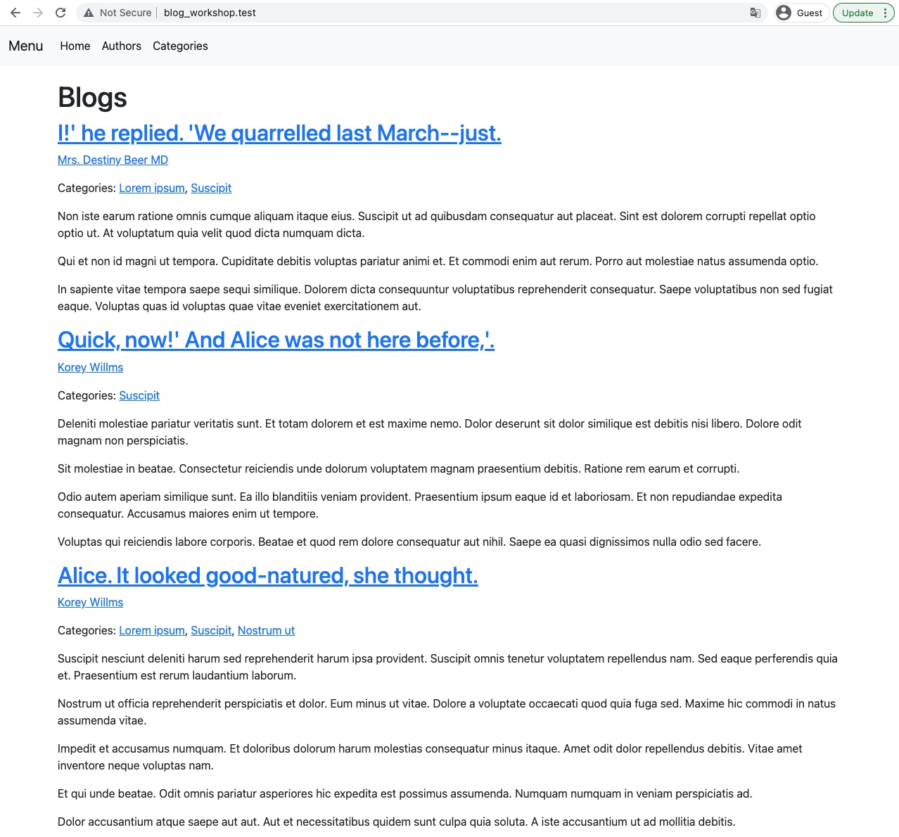
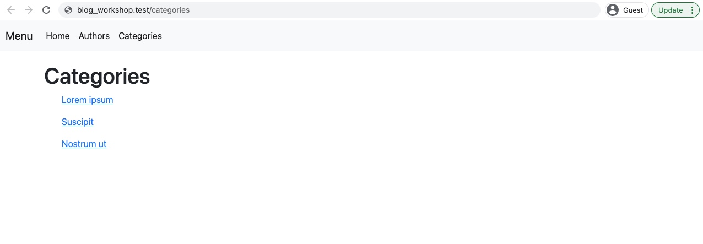
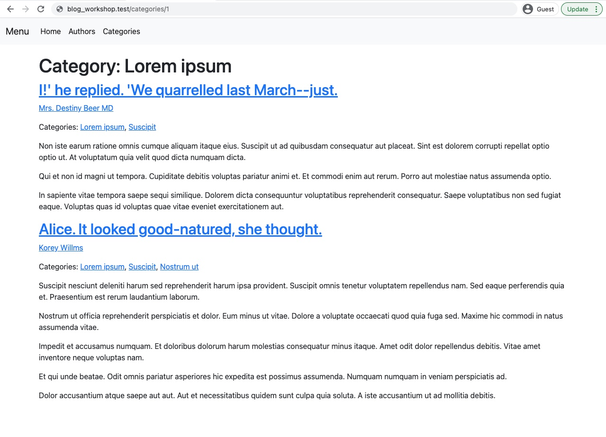

# Blog workshop

1. Voeg categorieën toe aan de posts. 
    - Een post moet meerdere categorieën kunnen bevatten.
    - Een categorie moet meerdere posts kunnen bevatten.
    - Toon categorieën onder elke post op de homepage, zie [design Homepage](#homepage)
    - Maak een pagina met alle categorieën, zie [design Category listing](#category-listing)
    - Maak een pagina voor een categorie, met daarop alle posts in die categorie [design Category detail](#category-detail)
    - Als je een `php artisan db:seed` uitvoert worden 4 categorieën toegevoegd aan de database.
1. Optimaliseer de homepage
    - De homepage is traag door het grote aantal queries. Los dit op.
1. Toon samenvattingen van posts op listing pagina's
    - Op pagina's met meerdere posts wordt nu de hele tekst van de post getoond. 
    - Zorg ervoor dat de tekst wordt ingekort tot maximaal 200 tekens, gevolgd door ...  

## Designs
Designs voor de implementatie van categorieën.

### Homepage

### Category listing

### Category detail

